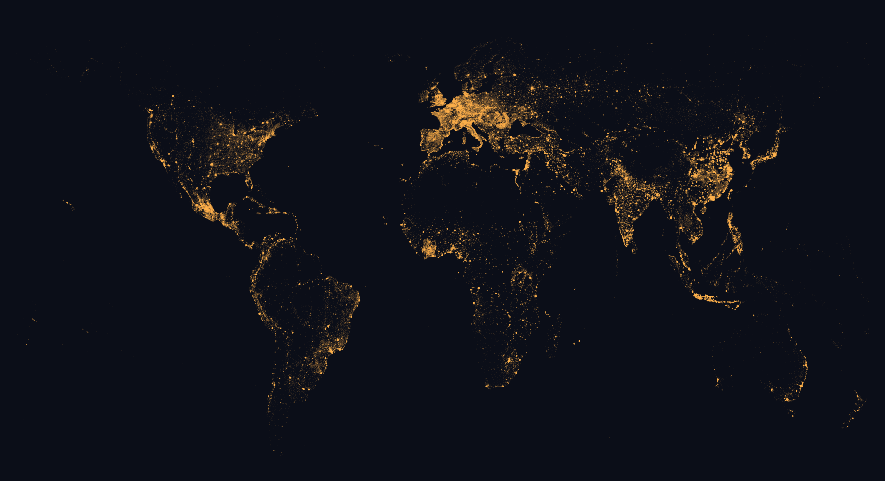

# city-slugs

Two canonical, URL-safe identifiers for each of 234,136 cities and towns
worldwide (every GeoNames populated place with population ≥ 500), fixed by a
deterministic rule:

- **`id`** — the short, recognizable form: `ber`, `sf`, `nyc`, `tyo` for cities
  with a curated metro / airport / colloquial code; equal to the slug otherwise.
- **`slug`** — the written-out form: `berlin`, `sanfrancisco`, `newyorkcity`.

Both are globally unique and resolve to the same city, so a link can read
`zeit.xyz/?c=ber,sf,nyc` or `zeit.xyz/?c=berlin,sanfrancisco,newyorkcity`. Born
in [Zeit, a world clock for iPhone, Mac, and the web](https://zeit.xyz) that
shows every city's local time under its live sky.

[](https://mirkokiefer.github.io/city-slugs/)

*The image is the dataset — 234,136 dots, nothing else. Click for the
[interactive map](https://mirkokiefer.github.io/city-slugs/).*

```
heidelberg                  Heidelberg, Germany
heidelberg_za               Heidelberg, Gauteng, South Africa
heidelberg_za_westerncape   Heidelberg, Western Cape, South Africa
paloalto                    Palo Alto, California, US
paloalto_mx                 Palo Alto, Aguascalientes, Mexico
```

Cities with a curated short `id` (the slug is always there too):

```
id   slug            city                id   slug          city
ber  berlin          Berlin              sf   sanfrancisco  San Francisco
nyc  newyorkcity     New York City       tyo  tokyo         Tokyo
bkk  bangkok         Bangkok             dxb  dubai         Dubai
```

## Why

Geocoding ids (GeoNames ids, place ids) are stable but opaque. Names are
readable but ambiguous — there are at least six Heidelbergs. This registry
gives each of them a single readable identifier that survives in a URL, a config file, or a conversation.

## The assignment rule

Slugs are claimed in **global population order**; each city takes the
**shortest free form**:

1. `name` — the bare slug (`paloalto`) goes to the most populous city of
   that name worldwide
2. `name_cc` — ISO 3166-1 alpha-2 country code (`paloalto_mx`)
3. `name_cc_region` — admin-1 region for within-country namesakes
   (`heidelberg_za_westerncape`)
4. `name_cc_region_N` — numeric suffix for the residual collisions
   (~0.9% of entries)

`name` is the GeoNames ASCII name, lowercased, diacritics folded, all
non-alphanumerics removed (`Ko Samui` → `kosamui`, `Travemünde` →
`travemuende`’s ASCII form `travemunde`).

The rule is deterministic: regenerating from the same GeoNames snapshot
yields the same assignment. Treat published slugs as append-only — a city's
slug should never be reassigned.

### Short ids

A city's **`id`** equals its slug unless it has a curated short form. Short ids
are claimed in the same global-population order, over a namespace **shared with
slugs**, so an id never collides with another city's slug:

1. **colloquial / short name** — `sf`, `la`, `nola` (human abbreviations)
2. **metro code** — `nyc`, `lon`, `tyo`
3. **iconic airport code** — `ber`, `ams`, `dxb` (a curated allow-list; cryptic
   codes like `bom` / `msy` are intentionally excluded and stay search aliases,
   so those cities keep their written slug as the id)
4. **otherwise `id = slug`**

A curated id may outrank a *strictly less populous* city's slug, which is then
bumped to its disambiguated form (New Orleans claims `nola`; Nola, CF → `nola_cf`).
Like slugs, treat ids as append-only.

## The map

Every city, one dot, scaled by population — click for the slug:
**https://mirkokiefer.github.io/city-slugs/**

## Use it

**JS / TS** — bundled tiers, zero dependencies:

```js
import { cities, bySlug, byId } from "city-slugs";
cities("100k");                    // 6,123 cities ≥ 100k, population-sorted
bySlug("15k").get("sanfrancisco"); // { id: "sf", name: "San Francisco", ... }
byId("15k").get("sf");             // same city, by its short id
```

**Browser / edge** — straight off the CDN:

```js
const all = await fetch("https://cdn.jsdelivr.net/gh/mirkokiefer/city-slugs@main/data/city-slugs.json").then(r => r.json());
```

**Python / pandas**:

```python
df = pd.read_csv("https://raw.githubusercontent.com/mirkokiefer/city-slugs/main/data/city-slugs.csv")
```

**DuckDB / data pipelines** — Parquet:

```sql
SELECT * FROM 'https://raw.githubusercontent.com/mirkokiefer/city-slugs/main/data/city-slugs.parquet'
WHERE country = 'DE' AND population > 50000;
```

**SQLite** — `data/city-slugs.db`, table `cities`, unique on `id` and `slug`,
indexed on `name`, `population`.

## Files

| file | cities | scope |
|---|---|---|
| `city-slugs.csv` / `.json` / `.parquet` / `.db` | 234,136 | population ≥ 500 |
| `city-slugs-15k.csv` / `.json` | 33,870 | population ≥ 15k |
| `city-slugs-100k.csv` / `.json` | 6,123 | population ≥ 100k |
| `city-slugs-1m.csv` / `.json` | 562 | population ≥ 1M |
| `city-slugs.min.json` | 234,136 | compact `[id,slug,name,lat,lng,pop]` rows for maps |

Columns: `id,slug,name,country,region,timezone,lat,lng,population`. Coordinates
are rounded to 2 decimals (~1 km). `timezone` is the IANA zone. `region` is
the GeoNames admin-1 name, present where it disambiguates. Regenerate all
derived formats with `node build.mjs`.

## Provenance & license

Derived from [GeoNames](https://www.geonames.org) (`cities500` +
`admin1CodesASCII`), which is licensed
[CC BY 4.0](https://creativecommons.org/licenses/by/4.0/). This dataset is
published under the same license.

Generated by the city pipeline of [Zeit — a world clock for iPhone, Mac,
and the web](https://zeit.xyz) that shows every city's local time under its
real sky: sun position, moon phase, and live weather in each timezone strip.
There, these slugs power share URLs (`zeit.xyz/?c=heidelberg,paloalto`).
